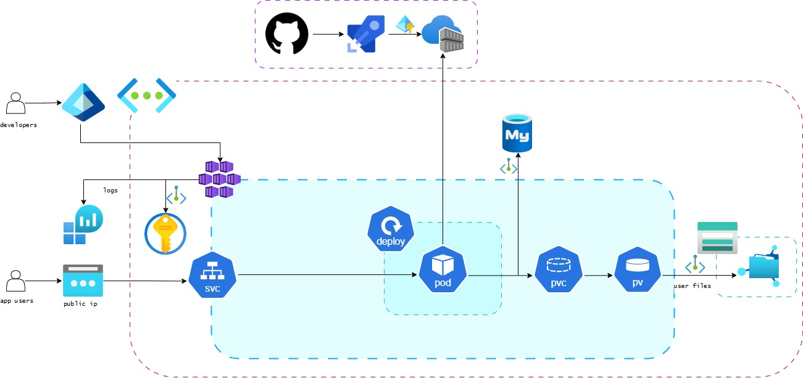

### 1. Executive Summary:
This report presents a Proof of Concept (PoC) of deploying the BeStrong API using Kubernetes.  
The goal was to validate Kubernetes as a platform for BeStrong’s future microservice architecture and demonstrate readiness for migration to Azure Kubernetes Service (AKS).

The PoC was implemented using Minikube as a local Kubernetes environment and confirms that the application can be deployed, exposed, and managed using standard Kubernetes primitives.

### 2. Problem statement
As BeStrong evolves, the application must support growth without increasing operational risk.

The current deployment approach creates several business challenges:
1. System growth requires manual intervention and reconfiguration

2. Application updates may cause downtime or service instability

3. Failures of a single application instance may lead to service unavailability

These limitations increase operational costs and slow down product development.

### 3. Proposed Solution
To address these challenges, a **container-based Kubernetes deployment model** was selected.

This approach separates:
- application logic
- infrastructure management
- data storage

The solution was validated locally using Minikube, which simulates the same behavior as Azure Kubernetes Service (AKS).

This allows BeStrong to validate the approach early, without cloud costs or risk to production systems.

###  4. Solution Justification
### 4.1 App Service -> AKS
#### 4.1.1 Limitations of the previous App Service-based approach
The initial deployment model based on a single Azure App Service instance is suitable for early-stage or low-load applications.  
However, as BeStrong grows, this approach introduces several business limitations:

1. Limited resilience  
   A failure of the application instance may result in service unavailability until manual intervention occurs.

2. Risk during updates  
   Application updates may temporarily disrupt service availability, increasing the risk of downtime during releases.

3. Tight coupling of application and infrastructure  
   Scaling, configuration changes, and operational tasks require manual actions and careful coordination.

4. Reduced flexibility for future growth  
   Introducing additional services or scaling individual components becomes increasingly complex.

These limitations increase operational risk and slow down the ability to respond to business growth and change.

##### 4.1.2 Why Kubernetes:
1. Reduced downtime risk
If an application instance stops working, Kubernetes automatically replaces it without manual intervention.

2. Faster and safer updates
Application updates can be deployed gradually, reducing the risk of outages during releases.

3. Predictable behavior across environments
The same deployment approach works locally and in Azure, reducing surprises during cloud migration.

4. Reduced operational risk as the system grows
The solution reduces dependency on manual operations and decreases the risk of human error as the system becomes more complex.

##### 4.2 Why Minikube Was Used for the PoC
Minikube was selected as the platform for the Proof of Concept because it allows validating architectural decisions without cloud costs or operational risk.

It provides behavior comparable to managed Kubernetes services, making the results applicable to future AKS deployment.

### 5. PoC Implementation Overview (Business-Oriented)
1. Reliability through (deployment)
The application was deployed in a way that ensures it continues running even if one instance fails.

2. Controlled application access (service)
The application was exposed through a managed access point, allowing users to access it in a predictable and controlled manner.

3. Data safety (pv + pvc):
Application data was separated from the application runtime (restarting the application does not lead to data loss).

### 6. Future Azure Architecture
- Application code stored in a central repository
- Automated build and delivery process (CI/CD)
- Central image storage (ACR)
- Kubernetes cluster as the runtime platform
- Managed database service
- Centralized secret management (KeyVault)
- Centralized logging and monitoring

The provided architecture diagram illustrates this target state:
