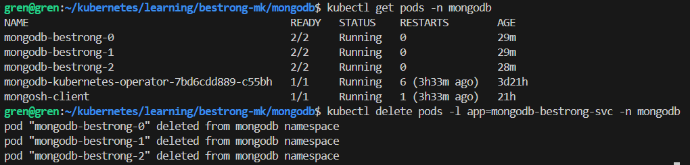

## Steps to install operator
Just from documentation:
1. git clone https://github.com/mongodb/mongodb-kubernetes-operator.git
2. kubectl apply -f config/crd/bases/mongodbcommunity.mongodb.com_mongodbcommunity.yaml
3. kubectl apply -k config/rbac/ --namespace mongodb
4. kubectl create -f config/manager/manager.yaml --namespace mongodb

Also it's optional to change same params, like configure the operator to watch other namespaces, or configure mongodb docker image, but i just let it as it is.

## Deploying
Just using the MongoDBCommunity custom resource and password:
[Link to mongo CR + secret](https://github.com/grenka12/dotnet-crud-web-api/blob/main/kubernetes/mongodb/mongodb.com_v1_mongodbcommunity_cr.yaml)

All that need to be deployed in the namespace that mongo operator is watching.

## Demonstration
Pre-condition: i've created collection in primary pod already
#### 1. Deleting pods

#### 2. Inside pod
```
kubectl exec -n mongodb -it mongodb-bestrong-0  -- bash


mongosh -u my-user -p ZLcz4VzVkc5IY8pL


mongodb-bestrong [direct: secondary] test> use BeStrong

switched to db BeStrong


mongodb-bestrong [direct: primary] BeStrong> show collections

BeStrong     // CREATED COLLECTION
```

As we can see collection** doesn't disappear** after deleting pods, data persisted.
